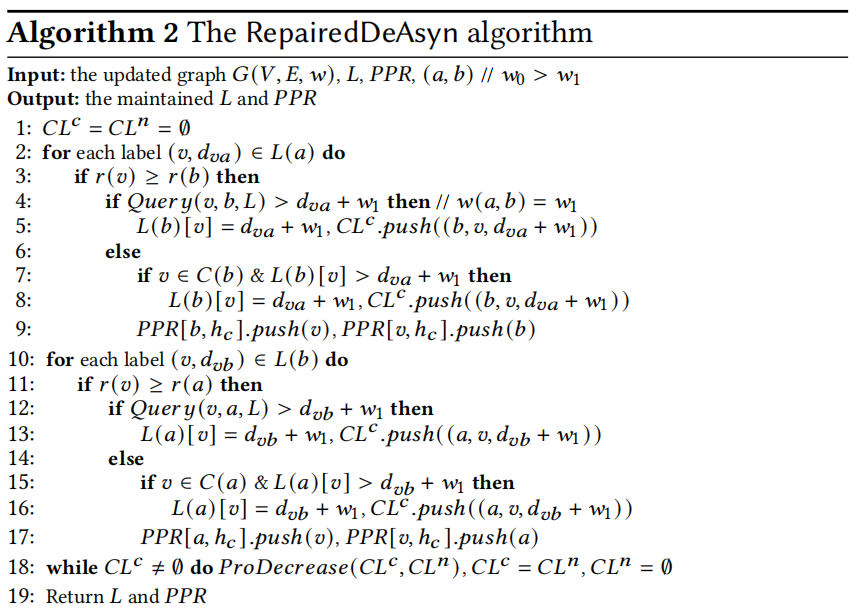
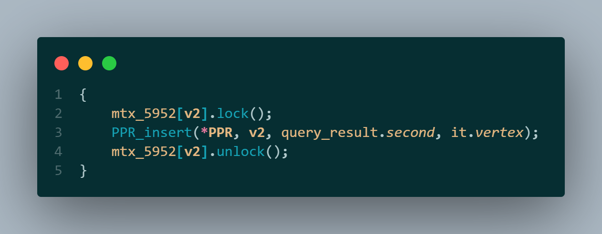
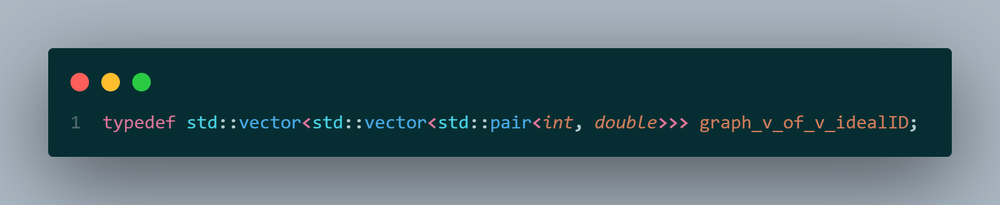
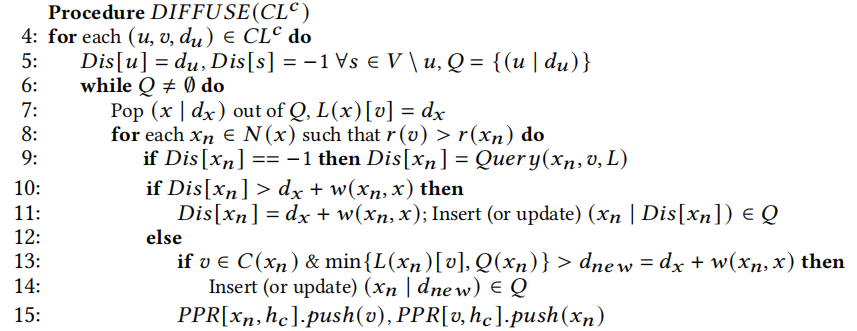
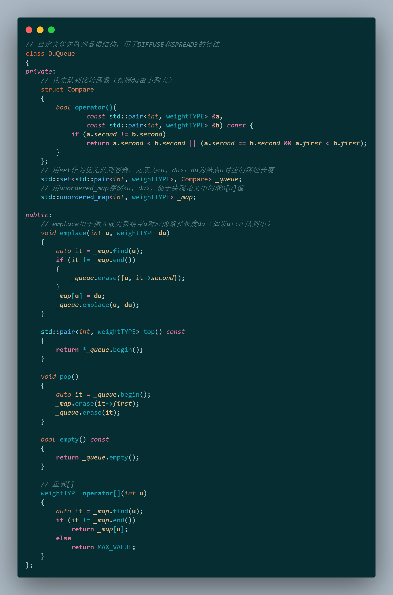

# 数据结构与算法2-大作业：复杂图中最短路径索引的动态维护

## 补全代码任务

**需要补全代码的位置,在目录 `build_in_progress\HL\dynamic\` 下：**

1. `WeightDecreaseMaintenance_improv.h#DIFFUSE` 函数的**TODO**部分
2.  `WeightIncreaseMaintenance_improv.h#SPREAD1` 函数的**TODO**部分
3. `WeightIncreaseMaintenance_improv.h#SPREAD2` 函数的**TODO**部分
4. `WeightIncreaseMaintenance_improv.h#SPREAD3` 函数的**TODO**部分

**除 `build_in_progress\HL\dynamic` 文件夹外, 其余文件均为辅助实现的部分代码, 可以不重点关注**。

下面对 `build_in_progress\HL\dynamic` 文件夹内文件及内部函数做简要释义。

### `test_dynamic.h` 

-  `test_dynamic` 
     - 测试函数，整个算法的调用入口在此，开头的注释部分注明了如何调用函数，以及编译运行的参数
     - 根据参数随机生成图，改变图的边权并执行索引动态维护算法，然后执行正确性检查
     - 其中含有多个控制参数便于debug测试，请详细读代码
-  `check_correctness_dynamic` 
     -  检查生成的索引正确性的函数，会被 `test_dynamic` 调用


-  `graph_change_and_label_maintenance` 
     -  改变图边权并动态维护索引的函数
     -  随机改变一条边的权重，然后调用索引维护的函数

### `PLL_dynamic.h` 

结合 $PPR$ 的 $PLL$ 算法的实现文件 

- `PLL_thread_function_dij_mixed` 
  - 从点 $v_k$ 执行剪枝的 $Dijkstra$ 算法

- `PLL_dynamic` 
  -  $PPL$ 实现函数，分为初始化和索引生成部分
  - 函数作用是生成索引和 $PPR$​ ，对应的伪代码参考阅读材料

### `PPR.h` 

-  `PPR_type` 
  - 自定义数据类型，为 $PPR$ 的数据类型
  - 一些 $PPR$ 的操作函数（插入、删除等）

### `two_hop_labels_base.h` 

- `two_hop_label_v1`
  - 索引结构
- `graph_hash_of_mixed_weighted_two_hop_case_info_v1` 
  - 存储 $PLL$ 相关参数和用时用量信息,主要用于传参
  - 同时存储生成的索引和PPR，因此想要查看生成的索引只需要调用 `print_L` 函数或 `print_PPR` 函数即可
- `insert_sorted_two_hop_label`
  - 向有序索引中插入元素的函数
- `search_sorted_two_hop_label` 和 `search_sorted_two_hop_label2`
  - 在索引中进行查找的函数 
- `affected_label` 
  - 边权变化后受影响的索引
- `graph_hash_of_mixed_weighted_two_hop_v1_extract_distance_no_reduc/2/3/4` 
  - 最短距离查询函数
  - 函数参数和返回值略有不同  

### `WeightDecreaseMaintenance_improv.h` 

是需要补全代码的文件，包含一个需要补全的函数。

- `WeightDecreaseMaintenance_improv_step1` 
  - 边权减小时的第一步操作，对应的伪代码参考阅读材料
-  `DIFFUSE` 
  - 需要补全的函数，对应的伪代码参考阅读材料
- `WeightDecreaseMaintenance_improv`  
  - 边权减小的索引维护函数，会调用以上两个子函数
  - 被 `graph_change_and_label_maintenance` 调用

### `WeightIncreaseMaintenance_improv.h` 

是需要补全代码的文件，包含三个需要补全的函数。

- `SPREAD1` ,  `SPREAD2` ,  `SPREAD3` 
  - 需要补全的函数,对应的伪代码参考阅读材料
- `WeightIncreaseMaintenance_improv` 
  - 边权增大的索引维护函数，会调用以上三个 `SPREAD` 函数
  - 被 `graph_change_and_label_maintenance` 调用

<div STYLE="page-break-after: always;"></div>

## 代码补全实现

### 实现思路

​	因为整体项目文件繁多、涉及函数调用复杂，所以我们首先根据论文中的算法伪代码，在项目已有代码的基础上，由需要的操作对应找出其要用到的函数、方法。总结归纳得出：

#### 需要实现的主要操作 

- 两个节点 $u, v$ 的优先级比较，即伪代码中的 $r[u] > r[v]$ 

- 根据现有的索引 $L$ 查询图中两点 $u, v$ 间距离（指最短路径长度，下同），即伪代码中的 $Query(u,v,L)$ 

- 在某个点 $u$ 的  2-hop labels 中查找它到某点 $v$ 的距离，即伪代码中的 $L(u)[v]$ 

- 添加 $PPR$ ，即伪代码中的 $PPR[u, h_c].push(v)$ ，其中 $h_c$ 就是 $u, v$ 的 " $hub$​ "

- 临时距离索引的建立和使用，即伪代码中的 $Dis[u] = d_u$​ 及其相关操作

- 临时“节点-距离”优先队列的建立和使用，即伪代码中的 $Q=\{(u | d_u)\}$​​ 及其相关操作

  ......


​	由论文可知： `DIFFUSE` 函数是 $FastDeM$ 算法下对应的待补全代码，而该算法在进行 $DIFFUSE$ 之前的预处理和 $Algorithm 2:$ The RepairedDeAsyn algorithm 的前半部分算法基本一致。

​	同时，这个预处理对应的代码是已知的，即 `WeightDecreaseMaintenance_improv_step1` 函数。

​	于是，可以对照该函数和 $Algorithm 2$ 前半部分，找出一些必须操作的代码实现。

​	这部分伪代码如下：

    

<div STYLE="page-break-after: always;"></div>

**逐行对照**伪代码与 `WeightDecreaseMaintenance_improv_step1` 函数代码，我们得知：

$3:$ **if** $r(v) \ge r(b)$ **then** 

对应代码为：

  

其中 `it` 是一个 2-hop label，代码结构为：


结合注释可知， $r(u) \ge r(v)$ 的代码实现为：

```cpp
  u <= v
```


$4:$ **if** $Query(v, b, L) > d_{va} + w_1$​ **then** 

对应代码为：


结合注释可知， $Query(u, v, L)$​ 的代码实现为：

```cpp
auto query_result = 
    graph_hash_of_mixed_weighted_two_hop_v1_extract_distance_no_reduc2(L, u, v); 
weightTYPE distance = query_result.first;
```

<div STYLE="page-break-after: always;"></div>

$9: PPR[b, h_c].push(v)$ 

对应代码为：

 

可得 $PPR[u, h_c].push(v)$ 的代码实现为：

```cpp
{
    mtx_5952[u].lock();
    PPR_insert(PPR, u, h_c, v);
    mtx_5952[u].unlock();
}
```


此外，由 `two_hop_labels_base.h` 中的函数可知， $L(u)[v] = d$ 对应代码实现为：

```cpp
{
    mtx_595_1.lock();
    insert_sorted_two_hop_label((*L)[u], v, d);
    mtx_595_1.unlock();
}
```

至此，我们已经掌握了伪代码中**几个反复出现的算法**对应的代码实现。

接下来，结合具体的代码补全任务，进一步补充所需数据结构及其相关代码。

<div STYLE="page-break-after: always;"></div>

#### `DIFFUSE` 函数

根据 $DIFFUSE$ 算法伪码，还需要我们自己实现 $D[u] = d_u$ 和 $Q = \{(u|d_u\}$ 。

$D[u]$ 的实现较为简单，用 `std::vector` 即可：

```cpp
std::vector<weightTYPE> Dis(instance_graph.size(), -1);
Dis[u] = du;
```

其中， `instance_graph` 是图的邻接矩阵，定义于已给出的 `graph_v_of_v_idealID` ：



由此也可以知道获取某节点的相邻节点，即 **for** each $x_n \in N(x)$ 的代码实现：

```cpp
// for each xn ∈ N(x) 
for (int i = 0; i < instance_graph[x].size(); ++i)
{
    int xn = instance_graph[x][i].first;
    weightTYPE w_xn_x = instance_graph[x][i].second;
    ...
}
```


$Q\{(u|d_u) \}$​ 是一个优先队列，但是根据算法，它不仅支持 `std::priority_queue` 的基本操作，还要求：

- 支持更新已在 $Q$ 内部的元素 $u$ 对应的 $d_u$ ，例如伪代码中的 $update (x_n | Dis[x_n]) \in Q$ 
- 支持按照 $u$ 为下标直接访问其对应的 $d_u$ ，例如伪代码中的计算 $min\{L(x_n)[v], Q(x_n) \}$​​ 

  

<div STYLE="page-break-after: always;"></div>

于是，我们自己写了一个符合上述要求的优先队列 `DuQueue` ，定义如下，功能实现思路见注释：



同时，该队列在后续的 `SPREAD3` 中也会用到。

<div STYLE="page-break-after: always;"></div>

现在我们可以补全 `DIFFUSE` 函数的代码了，只需要把论文中的**算法伪码逐行翻译**成我们的C++代码即可：

参数说明：


函数体：


<div STYLE="page-break-after: always;"></div>


