# 数据结构与算法2-大作业：复杂图中最短路径索引的动态维护

## 代码补全实现

### 实现思路

​	因为整体项目文件繁多、涉及函数调用复杂，所以我们首先根据论文中的**算法伪代码**，在项目**已有代码**的基础上，由需要的操作**对应找出**其要用到的函数、方法。总结归纳得出：

#### 需要实现的主要操作 

- 两个节点 $u, v$ 的优先级比较，即伪代码中的 $r[u] > r[v]$ 

- 根据现有的索引 $L$ 查询图中两点 $u, v$ 间距离（指最短路径长度，下同），即伪代码中的 $Query(u,v,L)$ 

- 在某个点 $u$ 的  $\mathrm{2-hop \enspace labels}$ 中查找它到某点 $v$ 的距离，即伪代码中的 $L(u)[v]$ 

- 添加 $PPR$ ，即伪代码中的 $PPR[u, h_c].push(v)$ ，其中 $h_c$ 就是 $u, v$ 的 " $hub$​ "

- 临时距离索引的建立和使用，即伪代码中的 $Dis[u] = d_u$​ 及其相关操作

- 临时“节点-距离”优先队列的建立和使用，即伪代码中的 $Q=\{(u | d_u)\}$​​ 及其相关操作

  ...

#### 算法伪码与实际代码的对应

​	由论文可知： `DIFFUSE` 函数是 $\mathrm{FastDeM}$ 算法下对应的待补全代码，而该算法在进行 $DIFFUSE$ 之前的预处理和 $\mathbf{Algorithm \enspace 2}\enspace \mathrm{The \enspace RepairedDeAsyn \enspace algorithm}$ 的前半部分算法基本一致。

​	同时，这个预处理对应的代码是已知的，即 `WeightDecreaseMaintenance_improv_step1` 函数。

​	于是，可以对照该函数和 $\mathbf{{Algorithm}\enspace{2}}$ 前半部分，找出一些必须操作的代码实现。

​	这部分伪代码如下：


<div STYLE="page-break-after: always;"></div>

**逐行对照**伪代码与 `WeightDecreaseMaintenance_improv_step1` 函数代码，我们得知：

$3:$ **if** $r(v) \ge r(b)$ **then** 

对应代码为：


其中 `it` 是一个 2-hop label，代码结构为：

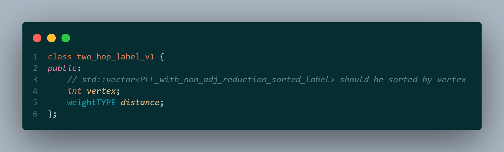

结合注释可知， $r(u) \ge r(v)$ 的代码实现为：

```cpp
  u <= v
```


$4:$ **if** $Query(v, b, L) > d_{va} + w_1$​ **then** 

对应代码为：

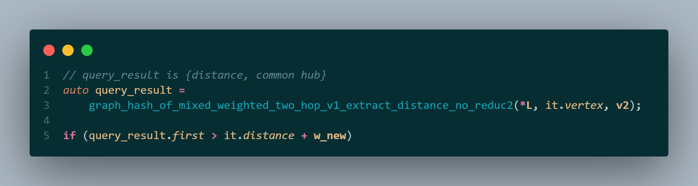

结合注释可知， $Query(u, v, L)$​ 的代码实现为：

```cpp
auto query_result = 
    graph_hash_of_mixed_weighted_two_hop_v1_extract_distance_no_reduc2(L, u, v); 
weightTYPE distance = query_result.first;
```

<div STYLE="page-break-after: always;"></div>

$9: PPR[b, h_c].push(v)$ 

对应代码为：

 

可得 $PPR[u, h_c].push(v)$ 的代码实现为：

```cpp
{
    mtx_5952[u].lock();
    PPR_insert(PPR, u, h_c, v);
    mtx_5952[u].unlock();
}
```


此外，由 `two_hop_labels_base.h` 中的函数可知， $L(u)[v] = d$ 对应代码实现为：

```cpp
{
    mtx_595_1.lock();
    insert_sorted_two_hop_label((*L)[u], v, d);
    mtx_595_1.unlock();
}
```

至此，我们已经掌握了伪代码中**几个反复出现的算法**对应的代码实现。

接下来，结合具体的代码补全任务，进一步补充所需数据结构及其相关代码。

<div STYLE="page-break-after: always;"></div>

#### `DIFFUSE` 函数

根据 $DIFFUSE$ 算法伪码，还需要我们自己实现 $D[u] = d_u$ 和 $Q = \{(u|d_u\}$ 。

$D[u]$ 的实现较为简单，用 `std::vector` 即可：

```cpp
std::vector<weightTYPE> Dis(instance_graph.size(), -1);
Dis[u] = du;
```

其中， `instance_graph` 是图的邻接矩阵，定义于已给出的 `graph_v_of_v_idealID` ：


由此也可以知道获取某节点的相邻节点，即 $\mathbf{for}\enspace\mathrm{each}\enspace x_n \in N(x)$ 的代码实现：

```cpp
// for each xn ∈ N(x) 
for (int i = 0; i < instance_graph[x].size(); ++i)
{
    int xn = instance_graph[x][i].first;
    weightTYPE w_xn_x = instance_graph[x][i].second;
    ...
}
```


$Q\{(u|d_u) \}$​ 是一个优先队列，但是根据算法，它不仅支持 `std::priority_queue` 的基本操作，还要求：

- 支持更新已在 $Q$ 内部的元素 $u$ 对应的 $d_u$ ，例如伪代码中的 $\mathrm{update}\enspace (x_n | Dis[x_n]) \in Q$ 
- 支持按照 $u$ 为下标直接访问其对应的 $d_u$ ，例如伪代码中的计算 $\mathrm{min}\{L(x_n)[v], Q(x_n) \}$​​ 


<div STYLE="page-break-after: always;"></div>

于是，我们自己写了一个符合上述要求的优先队列 `DuQueue` ，定义如下，功能实现思路见注释：


同时，该队列在后续的 `SPREAD3` 中也会用到。

<div STYLE="page-break-after: always;"></div>

现在我们可以补全 `DIFFUSE` 函数的代码了，只需要把论文中的**算法伪码逐行翻译**成我们的C++代码即可：

函数参数：


函数体：


<div STYLE="page-break-after: always;"></div>


<div STYLE="page-break-after: always;"></div>

#### `SPREAD1` 函数

$SPREAD1$​​ 算法伪码如下：

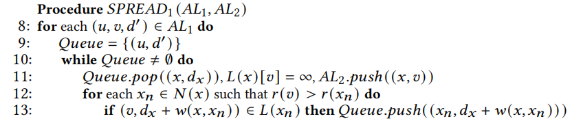

这里用到的 $Queue$ 只是一个普通的优先队列，用 `stl::priority_queue` 即可。其余部分，按伪码**逐行翻译**即可。

函数参数：


<div STYLE="page-break-after: always;"></div>

函数体：

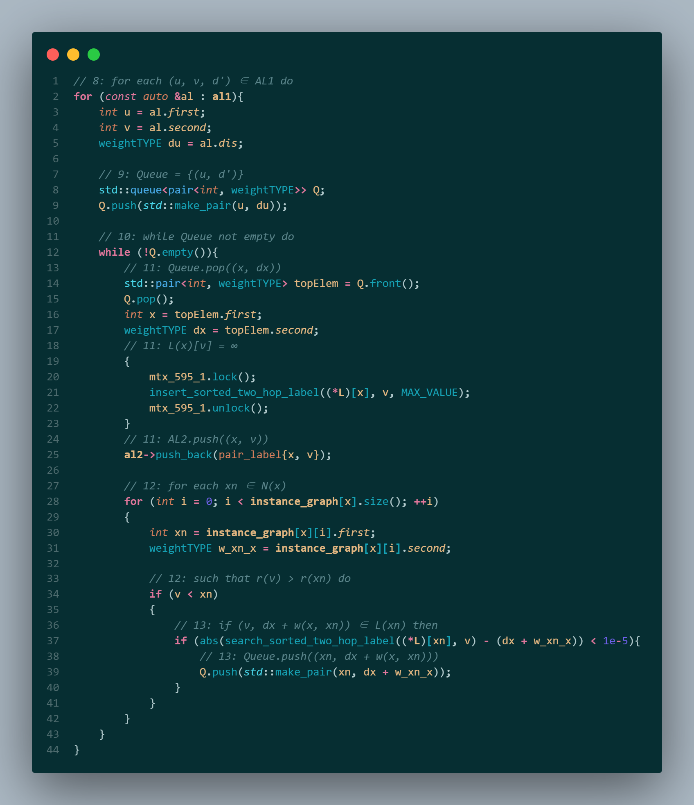

<div STYLE="page-break-after: always;"></div>

#### `SPREAD2` 函数

$SPREAD2$​ 的算法伪码如下：


同样的，其中基本操作的代码实现方式已经在前文展示过。将算法伪码**逐行翻译**成代码即可。

函数参数：


函数体：

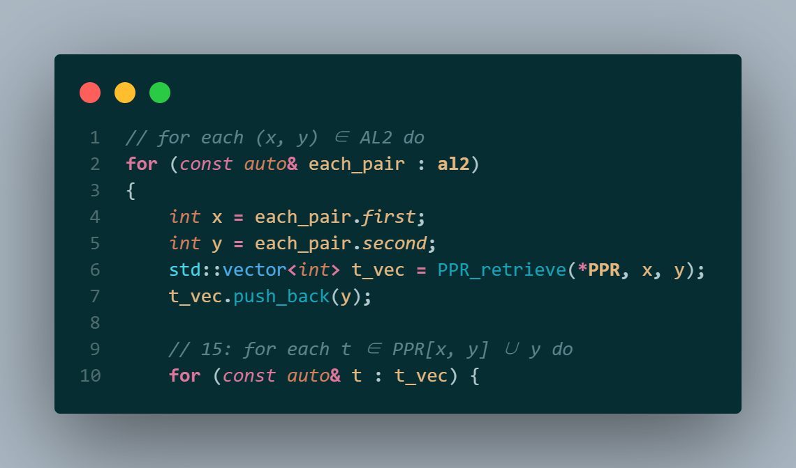


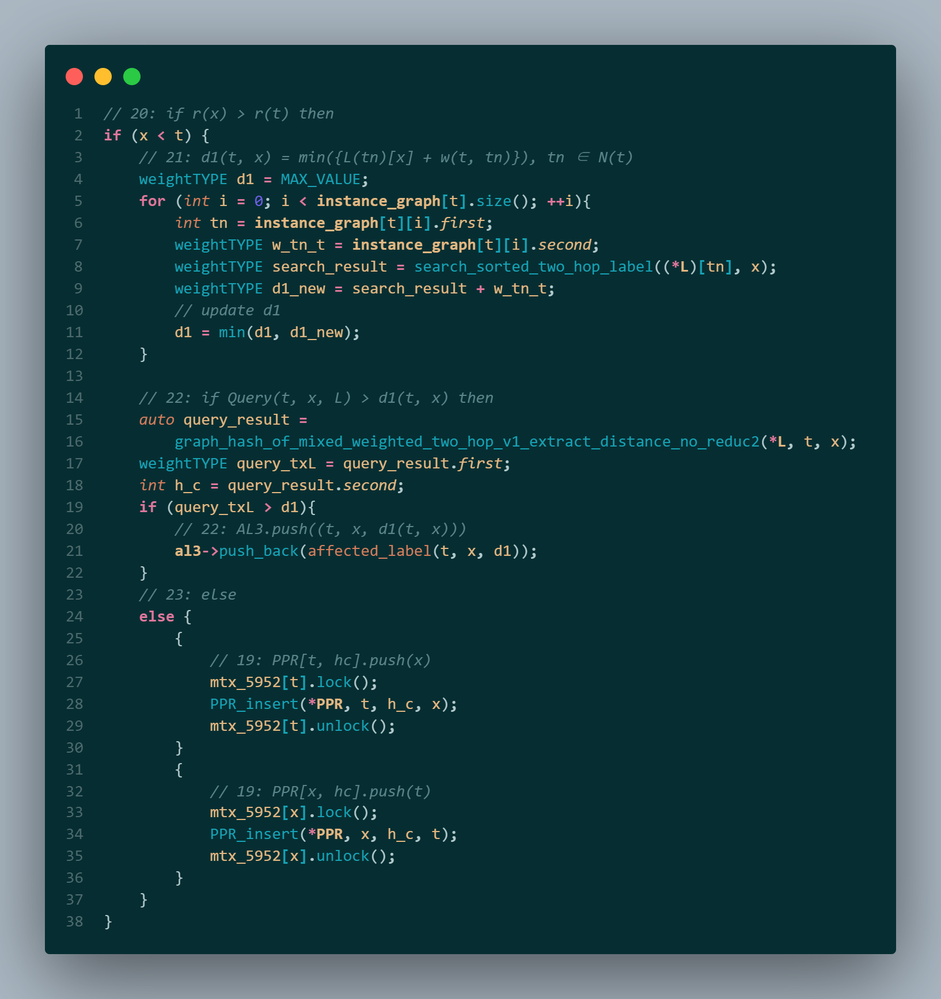

<div STYLE="page-break-after: always;"></div>

#### `SPREAD3` 函数

$SPREAD3$ 的算法伪码如下：


可以看出， $SPREAD3$ 与 $DIFFUSE$ 算法过程基本一致，且也要用的特殊的优先队列——前面已通过自定义的 `DuQueue` 实现。

函数参数：

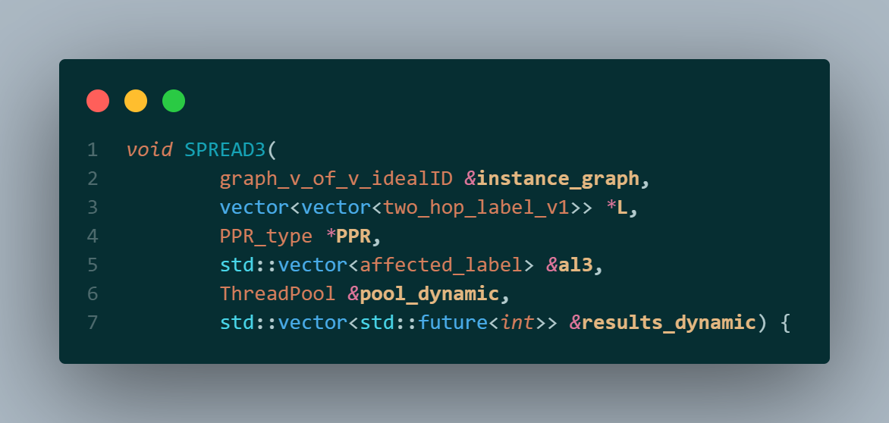

函数体：

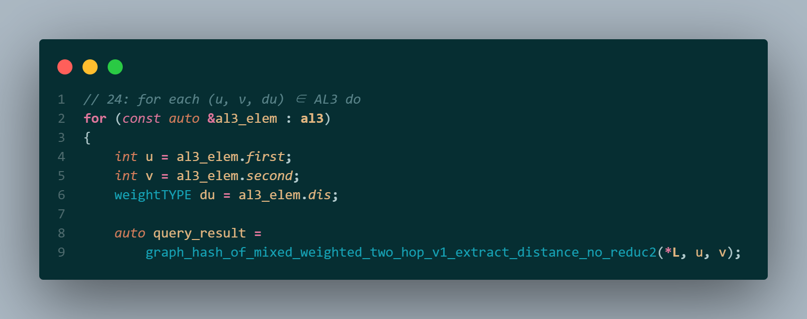

<div STYLE="page-break-after: always;"></div>


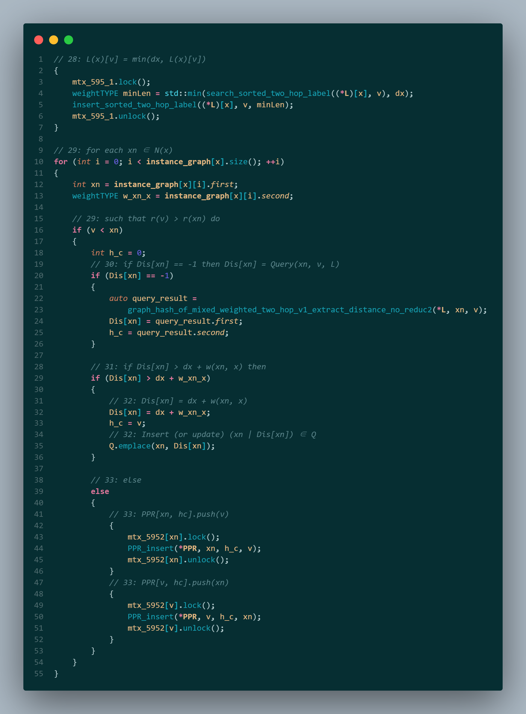

<div STYLE="page-break-after: always;"></div>

### 代码测试

测试参数：源文件中的初始参数设置如下

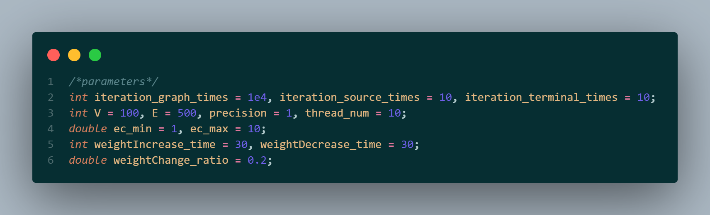

初始参数下运行结果如下：

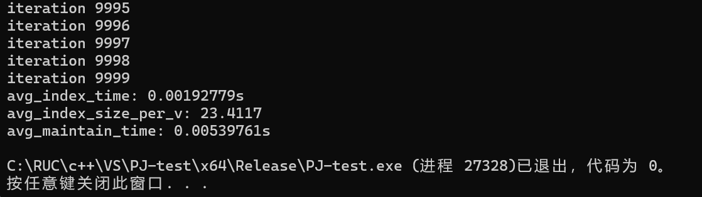

可以看出，本项目实现了**边权变化情况下复杂图最短路长索引的快速维护**，使索引更新速度达到了**毫秒**级别。

且经过多次检验，上述参数、10000轮测试为一组的情况下，每组出错次数平均不超过1次，**正确性**良好。


### 其他讨论

​	可以看到，四个待补充函数的参数中都提供了线程池等支持多线程的参数。我们也尝试编写了多线程版本的代码，经测试， `DIFFUSE` 函数可在多线程下正常运行，但是对查询速度的提升并不明显；而 `SPREAD1/2/3` 函数在多线程下运行不稳定，容易导致程序卡死、崩溃。这应该是因为我们对线程锁的运用有不恰当之处，或者有其他线程管理问题。这也是本项目可以进一步优化的地方。
