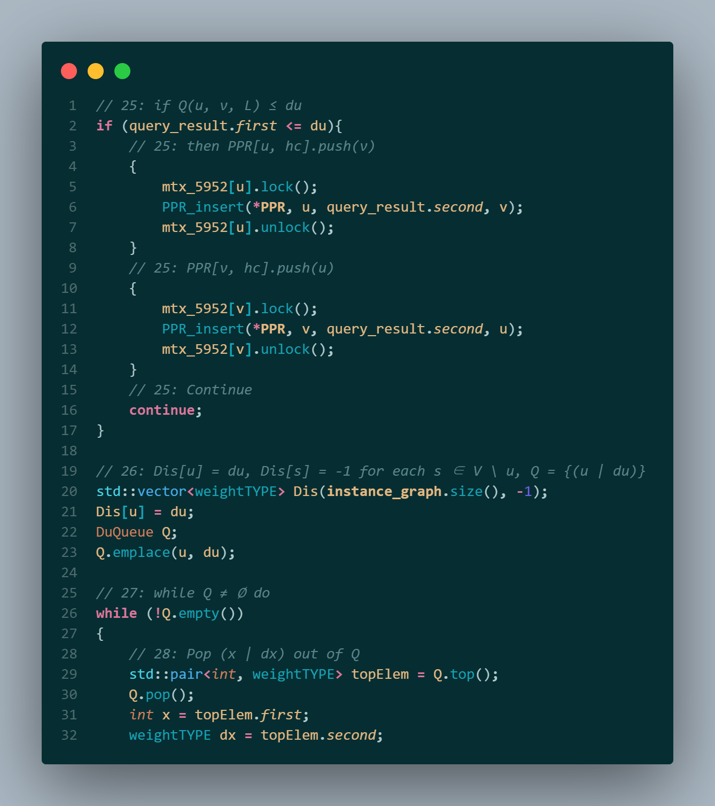

# 数据结构与算法&#8545;-大作业：<br>复杂图中最短路径索引的动态维护


**:bookmark_tabs:目录** 

***

[TOC]

- [test](#test)


**:handshake:分工说明**

***

本次大作业中，小组三位成员通力合作、默契配合，在论文理解、代码实现和报告撰写等方面均分工良好，最终取得了令我们满意的项目成果。

除了共同阅读、理解并多次研讨两篇论文材料，各成员具体贡献如下：

- **LBY：** 实现 `SPREAD1` 代码；撰写本报告“ $\mathrm{PPL}$ 算法理解”部分
- **CZA：** 实现 `SPREAD2` 代码；撰写本报告“补全算法理解”部分
- **FHT：** 实现 `DIFFUSE` 和 `SPREAD3` 代码；撰写本报告“代码补全实现”部分并汇总报告


<div STYLE="page-break-after: always;"></div>

## :one: $\mathrm{PPL}$ 算法理解

$\mathbf{PLL}(\mathbf{Pruned \enspace Landmark \enspace Labeling})$ 是一种专注于在大规模网络（例如社交网络、Web图和道路网络）上更加高效地解决最短路径问题的算法。

### 算法优势

**技术融合** 

- 结合了广度优先搜索（ $\mathrm{BFS}$ ）和一种新型剪枝（ $\mathrm{Prun}$ ）技术，用于减少搜索空间和标签大小。

- 关键创新在于在 $\mathrm{BFS}$ 中进行合适的剪枝操作，显著降低了时间开销。

**高效、准确、可扩展**

- 该方法可以处理具有数亿条边的网络——这是传统方法的两倍数量级。
- 作为一种精确方法， $\mathrm{PLL}$ 算法总是返回确切的最短路长，能够保证查询结果的准确性。
- 在空间和时间上都非常高效，可扩展到众多实际领域使用。

### 基本原理

**标签和 $2-hop$​ 覆盖** 

- 对于每个顶点 $v$ ，选择一个候选顶点集合 $C(v)$ ，使得每对顶点 $(u, v)$ 在它们之间的最短路径上至少有一个定点 $w \in C(u) \cup C(v)$ 。
- 顶点 $v$ 的距离标签 $L(v)$ 是一个有序对集合 $(d(u, v), \enspace u)$ ，其中 $u \in C(v)$ 。而通过使用这些标签作为索引，可以快速获取两顶点 $u$ 和 $v$ 之间的最短路径长度 $d(u, v)$ 。

**$\mathrm{BFS}$​ 过程中的剪枝** 

对于标准的 $\mathrm{BFS}$ 算法，它会遍历图中的所有顶点，这在大规模网络中极其费时费资源。

而在 $\mathrm{PLL}$ 算法中，每个顶点都有一个标签集合 $L(v)$ ，存储了从该顶点到其他顶点的已知最短路径长度，在进行 $\mathrm{BFS}$ 时，剪枝操作基于以下条件进行：


$$
\mathbf{if} \enspace QUERY(v_k, u,  L'_{k-1}) \le P[u] \enspace \mathbf{then} \enspace \mathrm{continue}
$$

>  $QUERY(v_k, u, L'_ {k-1})$ ：通过当前已知的标签集合 $L'_{k-1}$ 查询得到的 $v_k$ 和 $u$​ 之间的距离
>
>  $P[u]$ ： $\mathrm{BFS}$ 过程中为 $u$ 动态维护，表示从当前 $\mathrm{BFS}$ 的起点 $v_k$ 到 $u$​ 的最短路径长度估值

根据该剪枝规则，如果**通过已有标签的查询结果不大于当前 $\mathrm{BFS}$ 计算的距离**，那么当前路径不可能提供更短的路径，因此可以**剪枝**，无需对该顶点进行进一步拓展，从而减少 $\mathrm{BFS}$ 树的大小——这个剪枝操作对于减少搜索空间和计算工作量至关重要，具有以下效果：

- 提高搜索效率：通过避免拓展不必要的顶点，剪枝操作使得 $\mathrm{BFS}$ 只探索有可能提供更短路径的顶点，从而减少了搜索空间、提高搜索效率。
- 降低存储需求：通过减少 $\mathrm{BFS}$ 树的大小，剪枝操作减少了需要存储的中间结果，从而降低了存储需求。

**并行处理** 

-  $\mathrm{PLL}$ 支持利用位操作并行执行多个 $\mathrm{BFS}$​ ，进一步提高算法效率。

**总的来说，** $\mathrm{PLL}$ 算法通过在 $\mathrm{BFS}$ 过程中进行剪枝和并行 $\mathrm{BFS}$ 来高效处理大规模网络。它显著减少了搜索空间和标签大小，使其比传统方法更加高效、可扩展，适用于精确的距离查询。

<div STYLE="page-break-after: always;"></div>

## :two: 补全算法理解

###  $\mathrm{FastDeM}(用于在边权减小时维护标签索引的算法)$


$\mathrm{FastDeM}$ 算法需要补全的部分是 $DIFFUSE$ ，这个函数处理每个 $(u, v, d_u)\in CL^c$ ，最终生成新的索引 $L$ 和 $PPR$ 。

**首先，** 它初始化 $Dis[u] = d_u, Dis[s] = -1$ ，对于所有 $s \in V \textbackslash u$ 。同时初始化一个最小优先队列 $Q$ 包含一个组合的 $u, d_u$（第5行）。

**之后，** 在 $Q$ 非空的情况下循环，每次从优先队列 $Q$ 中取顶,在此时更新一个标签 $L(x)[v] = d_x$（第7行），然后处理 $x$ 的邻居节点，为每个 $x_n \in N(x)$ 且 $r(v) \ge r(x_n)$（第8行）进行检查，根据 $Dis$ 的情况分类处理。

如果 $Dis[x_n] == -1$ ，说明 $Dis[x_n]$ 尚未初始化，就设置 $Dis[x_n]$ 为当前索引下查询得到的 $x_n$ 和 $v$ 之间距离（第9行）。

**然后，** 如果 $Dis[x_n] > d_x + w(x_n, x)$ ，更新 $Dis[x_n]$ 为 $d_x + w(x_n, x)$ ，并把新的 $Dis$ 组合加入 $Q$（第11行）。否则，如果 $c \in C(x_n)$ 且 $\{L(x_n)[v], \enspace Q(x_n)\}$ 中最小的大于 $d_x + w(x_n, x)$（第13行），将新的 $Dis$ 组合加入 $Q$ 。无论查询的距离是否大于待更新的距离，该步骤都将更新所有过期标签。由于这一步， $Dis[x_n]$ 可能小于 $Q(x_n)$ ，但这样更新的标签不会导致错误的查询结果。这样进行更新可以保证所有的标签都可以被及时更新以便后续使用。

公共节点 $h_c$ 根据情况不同有着不同的赋值方式。具体而言，在第9行 $h_c$ 是由 $Query$ 给出的公共节点，而在第11行如果更新了 $Dis[n]$ 则 $h_c = v$ 。

**总的来说，** $DIFFUSE$ 算法实现了 $L$ 和 $PPR$ 的更新，在 $\mathrm{FastDeM}$ 算法中承担了主要功能。

<div STYLE="page-break-after: always;"></div>

### $\mathrm{FastInM}(用于在边权增加时维护标签索引的算法) $  


$\mathrm{FastInM}$ 算法需要补全的部分是三个 $SPREAD$ 函数，这三个函数依次处理传入的数组并形成新的数组传入下一个函数，最终由 $SPREAD3$ 给出更新的 $PPR$ 与 $L$ 。

- $SPREAD1$ 处理每个 $(u, v, d'') \in AL_1$（第8行）如下。

  首先用一个元素 $(u, d')$ 初始化一个队列 $Q$ 。在队列不为空的时候每次取出队首，将 $L(x)[v]$ 设置为无穷大 ，这样就停用了该标签。然后更新 $AL_2$（第11行）。

  接下来处理 $x$ 的邻居节点，为每个 $x_n \in N(x)$ 且 $r(v) > r(x_N)$（第12行），如果 $(v, d_x + w(x, x_n)) \in L(x_n)$ ，这说明 $v, d_x + w(x, x_n)$ 也对应一个路径通过 $(a, b)$ ，可以把这个标签添加到队列 $Q$（第13行）。

  循环结束后，就由 $AL_1$ 得到了 $AL_2$ ，在 $AL2$ 中记录了所有通过 $(a,b)$ 路径上受影响的点，供 $SPREAD2$ 使用。

- $SPREAD2$ 处理每个 $(x, y) \in AL_2$ （第14行）如下。

  为了识别由于标签被停用而受影响的节点，它枚举了每个 $t \in PPR[x, y] \cup y$（第15行）。

  如果 $r(t) > r(x)$，计算可能的最小距离 $d_1$， $d_1$ 是遍历 $x$ 的邻居节点、计算标签 $L(x_n)[t]+w(x,x_n)$ 得到的最小值。

  如果查询 $x$ 和 $t$ 之间的距离大于 $d_1(x, t)$ ，那么它将 $(x, t, d_1(x, t))$ 加入到 $AL_3$（第18行），这意味着 $L(x)[t] = d_1(x, t)$ 可能是新生成的。

  否则，它将 $t$ 插入 $PPR[x, h_c]$ ，并将 $x$ 插入 $PPR[t, h_c]$（第19行）, $h_c$ 是 $Query$ 给出的公共节点。

  如果 $r(x) > r(t)$ ，则以类似的方式进行处理，只是 $x$ 与 $t$ 相反。

  循环结束后，就由 $AL_2$ 得到了 $AL_3$ ，在 $AL_3$ 中记录了一些重新生成的标签，可以用这些标签作为起点生成更多标签。

- $SPREAD3$ 处理每个 $(x, y) \in AL_2$（第24行），并通过与 $DIFFUSE$ 类似的方式生成新的标签相同的枢纽 $v$ 。不过 $SPREAD3$ 检查查询到的 $u$ 和 $v$ 之间的距离，如果不大于 $d_u$（第25行），则将 $u, v$ 更新到 $PPR$ 进行剪枝。此外，当 $Dis[x_n] \le d_x + w(x_n, x)$ ， $SPREAD3$ 不会更新 $Q$ ，因为在 $SPREAD1$ 里已经停用了所有的过时的标签。

<div STYLE="page-break-after: always;"></div>

## :three: 代码补全实现

### 实现思路

因为整体项目文件繁多、涉及函数调用复杂，所以我们首先根据论文中的**算法伪代码**，在项目**已有代码**的基础上，由需要的操作**对应找出**其要用到的函数、方法。总结归纳得出：

#### 需要实现的主要操作 

- 两个节点 $u, v$ 的优先级比较，即伪代码中的 $r[u] > r[v]$ 

- 根据现有的索引 $L$ 查询图中两点 $u, v$ 间距离（指最短路径长度，下同），即伪代码中的 $Query(u,v,L)$ 

- 在某个点 $u$ 的  $\mathrm{2-hop \enspace labels}$ 中查找它到某点 $v$ 的距离，即伪代码中的 $L(u)[v]$ 

- 添加 $PPR$ ，即伪代码中的 $PPR[u, h_c].push(v)$ ，其中 $h_c$ 就是 $u, v$ 的 " $hub$​ "

- 临时距离索引的建立和使用，即伪代码中的 $Dis[u] = d_u$​ 及其相关操作

- 临时“节点-距离”优先队列的建立和使用，即伪代码中的 $Q=\{(u | d_u)\}$​​ 及其相关操作

  ...


## test


#### 算法伪码与实际代码的对应

**由论文可知：** `DIFFUSE` 函数是 $\mathrm{FastDeM}$ 算法下对应的待补全代码，而该算法在进行 $DIFFUSE$ 之前的预处理和 $\mathbf{Algorithm \enspace 2}\enspace \mathrm{The \enspace RepairedDeAsyn \enspace algorithm}$ 的前半部分算法基本一致。

**同时，** 这个预处理对应的代码是已知的，即 `WeightDecreaseMaintenance_improv_step1` 函数。

**于是，** 可以对照该函数和 $\mathbf{{Algorithm}\enspace{2}}$ 前半部分，找出一些必须操作的代码实现。

这部分伪代码如下：


<div STYLE="page-break-after: always;"></div>

**逐行对照** 伪代码与 `WeightDecreaseMaintenance_improv_step1` 函数代码，我们得知：

$3:$ **if** $r(v) \ge r(b)$ **then** 

对应代码为：


其中 `it` 是一个 $\mathrm{2\!-\!hop \enspace label}$ ，代码结构为：


结合注释可知， $r(u) \ge r(v)$ 的代码实现为：

```cpp
  u <= v
```


$4:$ **if** $Query(v, b, L) > d_{va} + w_1$​ **then** 

对应代码为：


结合注释可知， $Query(u, v, L)$​ 的代码实现为：

```cpp
auto query_result = 
    graph_hash_of_mixed_weighted_two_hop_v1_extract_distance_no_reduc2(L, u, v); 
weightTYPE distance = query_result.first;
```

<div STYLE="page-break-after: always;"></div>

$9: PPR[b, h_c].push(v)$ 

对应代码为：

 

可得 $PPR[u, h_c].push(v)$ 的代码实现为：

```cpp
{
    mtx_5952[u].lock();
    PPR_insert(PPR, u, h_c, v);
    mtx_5952[u].unlock();
}
```


此外，由 `two_hop_labels_base.h` 中的函数可知， $L(u)[v] = d$ 对应代码实现为：

```cpp
{
    mtx_595_1.lock();
    insert_sorted_two_hop_label((*L)[u], v, d);
    mtx_595_1.unlock();
}
```

至此，我们已经掌握了伪代码中**几个反复出现的算法**对应的代码实现。

接下来，结合具体的代码补全任务，进一步补充所需数据结构及其相关代码。

<div STYLE="page-break-after: always;"></div>

#### `DIFFUSE` 函数

根据 $DIFFUSE$ 算法伪码，还需要我们自己实现 $D[u] = d_u$ 和 $Q = \{(u|d_u\}$ 。

$D[u]$ 的实现较为简单，用 `std::vector` 即可：

```cpp
std::vector<weightTYPE> Dis(instance_graph.size(), -1);
Dis[u] = du;
```

其中， `instance_graph` 是图的邻接矩阵，定义于已给出的 `graph_v_of_v_idealID` ：


由此也可以知道获取某节点的相邻节点，即 $\mathbf{for}\enspace\mathrm{each}\enspace x_n \in N(x)$ 的代码实现：

```cpp
// for each xn ∈ N(x) 
for (int i = 0; i < instance_graph[x].size(); ++i)
{
    int xn = instance_graph[x][i].first;
    weightTYPE w_xn_x = instance_graph[x][i].second;
    ...
}
```


$Q\{(u|d_u) \}$​ 是一个优先队列，但是根据算法，它不仅支持 `std::priority_queue` 的基本操作，还要求：

- 支持更新已在 $Q$ 内部的元素 $u$ 对应的 $d_u$ ，例如伪代码中的 $\mathrm{update}\enspace (x_n | Dis[x_n]) \in Q$ 
- 支持按照 $u$ 为下标直接访问其对应的 $d_u$ ，例如伪代码中的计算 $\mathrm{min}\enspace \{L(x_n)[v], Q(x_n)\}$​​ 


<div STYLE="page-break-after: always;"></div>

于是，我们自己写了一个符合上述要求的优先队列 `DuQueue` ，定义如下，功能实现思路见注释：


同时，该队列在后续的 `SPREAD3` 中也会用到。

<div STYLE="page-break-after: always;"></div>

现在我们可以补全 `DIFFUSE` 函数的代码了，只需要把论文中的**算法伪码逐行翻译**成我们的C++代码即可：

函数参数：


函数体：


<div STYLE="page-break-after: always;"></div>


<div STYLE="page-break-after: always;"></div>

#### `SPREAD1` 函数

$SPREAD1$​​ 算法伪码如下：


这里用到的 $Queue$ 只是一个普通的优先队列，用 `stl::priority_queue` 即可。其余部分，按伪码**逐行翻译**即可。

函数参数：


<div STYLE="page-break-after: always;"></div>

函数体：


<div STYLE="page-break-after: always;"></div>

#### `SPREAD2` 函数

$SPREAD2$​ 的算法伪码如下：


同样的，其中基本操作的代码实现方式已经在前文展示过。将算法伪码**逐行翻译**成代码即可。

函数参数：


<div STYLE="page-break-after: always;"></div>

函数体：


<div STYLE="page-break-after: always;"></div>

#### `SPREAD3` 函数

$SPREAD3$ 的算法伪码如下：


可以看出， $SPREAD3$ 与 $DIFFUSE$ 算法过程基本一致，且也要用的特殊的优先队列——前面已通过自定义的 `DuQueue` 实现。

函数参数：


函数体：


<div STYLE="page-break-after: always;"></div>




<div STYLE="page-break-after: always;"></div>

### 代码测试

测试参数：源文件中的初始参数设置如下


初始参数下运行结果如下：


可以看出，本项目实现了**边权变化情况下复杂图最短路长索引的快速维护**，使索引更新速度达到了**毫秒**级别。

且经多次检验，上述参数、一万轮测试为一组的情况下，每组出错次数平均不超过1次，具有良好**精确性**。


### 优化讨论

可以看到，四个待补充函数的参数中都提供了线程池等支持多线程的参数，且 $\mathrm{PLL}$ 论文中也指出算法可以基于位运算实现多个 $\mathrm{BFS}$ 并行。

我们也尝试编写了多线程版本的代码。经测试， `DIFFUSE` 函数可在多线程下正常运行，但是对查询速度的提升并不明显；而 `SPREAD1/2/3` 函数在多线程下运行不稳定，容易导致程序卡死、崩溃。这应该是因为我们对线程锁的运用有不恰当之处，或者有其他线程管理问题。这也是本项目可以进一步优化的地方。
